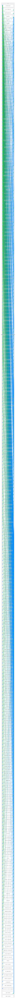
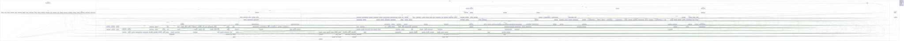

# fMoney - Flutter edition

From the MoneyTools vTeam, we bring you the flutter edition of the MyMoney.net app

## Getting Started

### GitHub

- <https://github.com/MoneyTools/MoneyFlutter>
This is the Flutter app, you will need to install the Flutter/Dart frameWork and an IDE, we suggest VSCode.

## Install tools

- ### VSCode

  - <https://code.visualstudio.com/download>

- ### Flutter * Dart

  - <https://docs.flutter.dev/get-started/install>

### Build, Run the app and when stared tap/click "Use Demo Data"

1. Open the root folder in VSCode
  
2. Select a client, the app can builds and run on these Flutter supported platforms

   - iOS
   - Android
   - MacOS
   - Windows
   - Web
   - Linux

## Demo version

<https://money.vteam.com>

## Main UI


## AI Assistant Feature

The fMoney app now includes a powerful AI assistant powered by Ollama, providing intelligent insights into your financial data.

### Getting Started with AI

1. **Install Ollama**: Follow the instructions in the app to install Ollama on your system
2. **Download Models**: The AI assistant uses various language models (LLaMA, etc.) for analysis
3. **Start Using**: Access the AI assistant from the main navigation

### AI Features

#### 💬 **Chat Interface**
- Interactive conversation with the AI about your finances
- Message history with timestamps and read more/less functionality
- Copy messages to clipboard
- Expandable messages for better readability

#### 🤖 **AI Models**
- Switch between different AI models (LLaMA 3.2, etc.)
- Automatic model detection and installation
- Model size information and management

#### 📊 **Preset Financial Queries**
Quick access preset buttons for common financial analyses:
- **Account Names**: List all your account names
- **Largest Transactions**: Identify the biggest transactions per account
- **Analyze Spending**: Get insights into spending patterns
- **Expense Predictions**: Forecast future expenses

#### 🎯 **Intelligent Features**
- Teach AI about your accounts using the "BankAccounts" button
- Real-time processing status with cancel functionality
- Context-aware responses based on your financial data
- Formatted display of token counts and conversation statistics

### Technical Architecture

#### Core Components
- **ViewAIInstructions**: Setup and installation guidance
- **ViewAiHeader**: Model selection, chat statistics, and controls
- **ChatMessageFooter**: Message actions (copy, expand, details)
- **ChatInputArea**: Text input with preset buttons and processing states

#### AI Integration
- **Ollama Service**: Handles AI model communication and responses
- **Chat Messages**: Persistent message history with metadata
- **Real-time Processing**: Streaming responses with cancellation support

### Prerequisites

**Ollama Installation**: The app will guide you through installing Ollama, but you can also visit [ollama.com/download](https://ollama.com/download) for manual installation.

**Supported Platforms**: The AI assistant works across all Flutter-supported platforms where Ollama can run.

### Testing

Comprehensive unit test coverage for all AI components:
- `view_ai_header_test.dart`: Header functionality and model selection
- `view_ai_instructions_test.dart`: Setup and installation UI
- `view_ai_chat_message_footer_test.dart`: Message actions and display
- `view_ai_input_test.dart`: Input handling and preset queries
- `view_ai_chat_message_test.dart`: Message serialization and deserialization

## Data

### SQLite Tables

#### 1 - AccountAliases

```bash
sqlite3 mydata.MyMoney.mmdb .schema
sqlite3 mydata.MyMoney.mmdb .dumb > backup.sql
```

```text
cid  name       type           notnull  dflt_value  pk
---  ---------  -------------  -------  ----------  --
0    Id         INT            0                    1 
1    Pattern    nvarchar(255)  1                    0 
2    Flags      INT            1                    0 
3    AccountId  nchar(20)      1                    0 
```

#### 2 - Accounts

```text
cid  name                    type              notnull  dflt_value  pk
---  ----------------------  ----------------  -------  ----------  --
0    Id                      INT               0                    1
1    AccountId               nchar(20)         0                    0
2    OfxAccountId            nvarchar(50)      0                    0
3    Name                    nvarchar(80)      1                    0
4    Description             nvarchar(255)     0                    0
5    Type                    INT               1                    0
6    OpeningBalance          money             0                    0
7    Currency                nchar(3)          0                    0
8    OnlineAccount           INT               0                    0
9    WebSite                 nvarchar(512)     0                    0
10   ReconcileWarning        INT               0                    0
11   LastSync                datetime          0                    0
12   SyncGuid                uniqueidentifier  0                    0
13   Flags                   INT               0                    0
14   LastBalance             datetime          0                    0
15   CategoryIdForPrincipal  INT               0                    0
16   CategoryIdForInterest   INT               0                    0
```

#### 3 - Aliases

```text
cid  name     type           notnull  dflt_value  pk
---  -------  -------------  -------  ----------  --
0    Id       INT            0                    1
1    Pattern  nvarchar(255)  1                    0
2    Flags    INT            1                    0
3    Payee    INT            1                    0
```

#### 4 - Categories

```text
cid  name         type           notnull  dflt_value  pk
---  -----------  -------------  -------  ----------  --
0    Id           INT            0                    1 
1    ParentId     INT            0                    0 
2    Name         nvarchar(80)   1                    0 
3    Description  nvarchar(255)  0                    0 
4    Type         INT            1                    0 
5    Color        nchar(10)      0                    0 
6    Budget       money          0                    0 
7    Balance      money          0                    0 
8    Frequency    INT            0                    0 
9    TaxRefNum    INT            0                    0
```

#### 5 - Currencies

```text
cid  name         type          notnull  dflt_value  pk
---  -----------  ------------  -------  ----------  --
0    Id           INT           0                    1 
1    Symbol       nchar(20)     1                    0 
2    Name         nvarchar(80)  1                    0 
3    Ratio        money         0                    0 
4    LastRatio    money         0                    0 
5    CultureCode  nvarchar(80)  0                    0 
```

#### 6 - Investments

```text
cid  name            type    notnull  dflt_value  pk
---  --------------  ------  -------  ----------  --
0    Id              bigint  0                    1 
1    Security        INT     1                    0 
2    UnitPrice       money   1                    0 
3    Units           money   0                    0 
4    Commission      money   0                    0 
5    MarkUpDown      money   0                    0 
6    Taxes           money   0                    0 
7    Fees            money   0                    0 
8    Load            money   0                    0 
9    InvestmentType  INT     1                    0 
10   TradeType       INT     0                    0 
11   TaxExempt       bit     0                    0 
12   Withholding     money   0                    0 
```

#### 7 - LoanPayments

```text
cid  name       type           notnull  dflt_value  pk
---  ---------  -------------  -------  ----------  --
0    Id         INT            1                    0
1    AccountId  INT            1                    0
2    Date       datetime       1                    0
3    Principal  money          0                    0
4    Interest   money          0                    0
5    Memo       nvarchar(255)  0                    0
```

#### 8 - OnlineAccounts

```text
cid  name               type            notnull  dflt_value  pk
---  -----------------  --------------  -------  ----------  --
0    Id                 INT             0                    1
1    Name               nvarchar(80)    1                    0
2    Institution        nvarchar(80)    0                    0
3    OFX                nvarchar(255)   0                    0
4    OfxVersion         nchar(10)       0                    0
5    FID                nvarchar(50)    0                    0
6    UserId             nchar(20)       0                    0
7    Password           nvarchar(50)    0                    0
8    UserCred1          nvarchar(200)   0                    0
9    UserCred2          nvarchar(200)   0                    0
10   AuthToken          nvarchar(200)   0                    0
11   BankId             nvarchar(50)    0                    0
12   BranchId           nvarchar(50)    0                    0
13   BrokerId           nvarchar(50)    0                    0
14   LogoUrl            nvarchar(1000)  0                    0
15   AppId              nchar(10)       0                    0
16   AppVersion         nchar(10)       0                    0
17   ClientUid          nchar(36)       0                    0
18   AccessKey          nchar(36)       0                    0
19   UserKey            nvarchar(64)    0                    0
20   UserKeyExpireDate  datetime        0                    0
```

#### 9 - Payees

```text
cid  name  type           notnull  dflt_value  pk
---  ----  -------------  -------  ----------  --
0    Id    INT            0                    1 
1    Name  nvarchar(255)  1                    0
```

#### 10 - RentBuildings

```text
cid  name                    type           notnull  dflt_value  pk
---  ----------------------  -------------  -------  ----------  --
0    Id                      INT            0                    1
1    Name                    nvarchar(255)  1                    0
2    Address                 nvarchar(255)  0                    0
3    PurchasedDate           datetime       0                    0
4    PurchasedPrice          money          0                    0
5    LandValue               money          0                    0
6    EstimatedValue          money          0                    0
7    OwnershipName1          nvarchar(255)  0                    0
8    OwnershipName2          nvarchar(255)  0                    0
9    OwnershipPercentage1    money          0                    0
10   OwnershipPercentage2    money          0                    0
11   Note                    nvarchar(255)  0                    0
12   CategoryForTaxes        INT            0                    0
13   CategoryForIncome       INT            0                    0
14   CategoryForInterest     INT            0                    0
15   CategoryForRepairs      INT            0                    0
16   CategoryForMaintenance  INT            0                    0
17   CategoryForManagement   INT            0                    0
```

#### 11 - RentUnits

```text
cid  name      type           notnull  dflt_value  pk
---  --------  -------------  -------  ----------  --
0    Id        INT            0                    1 
1    Building  INT            1                    0 
2    Name      nvarchar(255)  1                    0 
3    Renter    nvarchar(255)  0                    0 
4    Note      nvarchar(255)  0                    0 
```

#### 12 - Securities

```text
cid  name          type          notnull  dflt_value  pk
---  ------------  ------------  -------  ----------  --
0    Id            INT           0                    1
1    Name          nvarchar(80)  1                    0
2    Symbol        nchar(20)     1                    0
3    Price         money         0                    0
4    LastPrice     money         0                    0
5    CUSPID        nchar(20)     0                    0
6    SECURITYTYPE  INT           0                    0
7    TAXABLE       tinyint       0                    0
8    PriceDate     datetime      0                    0
```

#### 13 - Splits

```text
cid  name               type           notnull  dflt_value  pk
---  -----------------  -------------  -------  ----------  --
0    Transaction        bigint         1                    0 
1    Id                 INT            1                    0 
2    Category           INT            0                    0 
3    Payee              INT            0                    0 
4    Amount             money          1                    0 
5    Transfer           bigint         0                    0 
6    Memo               nvarchar(255)  0                    0 
7    Flags              INT            0                    0 
8    BudgetBalanceDate  datetime       0                    0 
```

#### 14 - StockSplits

```text
cid  name         type      notnull  dflt_value  pk
---  -----------  --------  -------  ----------  --
0    Id           bigint    0                    1 
1    Date         datetime  1                    0 
2    Security     INT       1                    0 
3    Numerator    money     1                    0 
4    Denominator  money     1                    0 
```

#### 15 - TransactionExtras

```text
cid  name         type      notnull  dflt_value  pk
---  -----------  --------  -------  ----------  --
0    Id           INT       0                    1
1    Transaction  bigint    1                    0
2    TaxYear      INT       1                    0
3    TaxDate      datetime  0                    0
```

#### 16 - Transactions

```text
cid  name               type           notnull  dflt_value  pk
---  -----------------  -------------  -------  ----------  --
0    Id                 bigint         0                    1 
1    Account            INT            1                    0 
2    Date               datetime       1                    0 
3    Status             INT            0                    0 
4    Payee              INT            0                    0 
5    OriginalPayee      nvarchar(255)  0                    0 
6    Category           INT            0                    0 
7    Memo               nvarchar(255)  0                    0 
8    Number             nchar(10)      0                    0 
9    ReconciledDate     datetime       0                    0 
10   BudgetBalanceDate  datetime       0                    0 
11   Transfer           bigint         0                    0 
12   FITID              nchar(40)      0                    0 
13   Flags              INT            1                    0 
14   Amount             money          1                    0 
15   SalesTax           money          0                    0 
16   TransferSplit      INT            0                    0 
17   MergeDate          datetime       0                    0 
```

## Code Style

Ensure your code is formatted correctly by running this CLI before committing changes

macOS

```bash
./check.sh
```

Windows

```batch
./check.cmd
```

## Layer Dependency Diagram



## Graph Call

install

```dart pub global activate lakos```

```brew install graphviz```

run
```./graph.sh```



## Deploy

### to Web

- Install Firebase tool
  ```npm install -g firebase-tools```

- Enable firebase experiments
  ```firebase experiments:enable webframeworks```

- Deploy to your account
  ```firebase deploy```

### To Android Google Play

- Build the bundle
  
  ```flutter build appbundle```

- Google App Console
  - <https://play.google.com/console>
  - Upload the bundle
